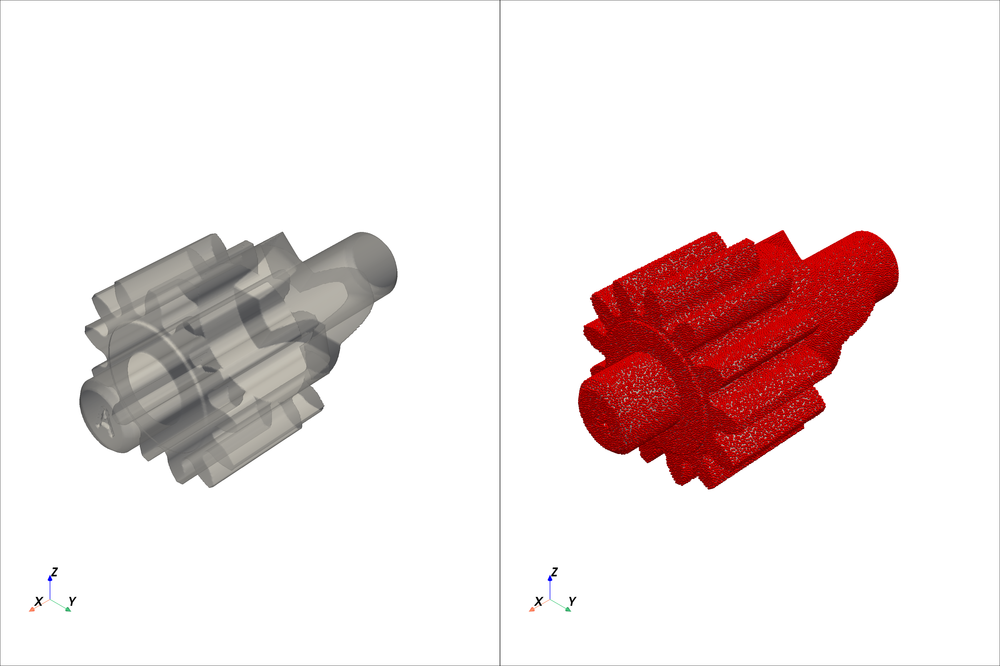
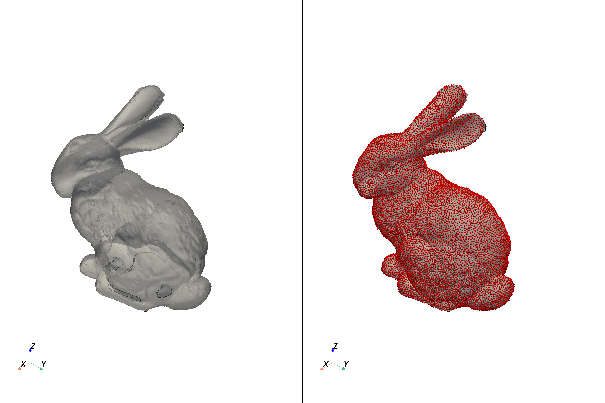
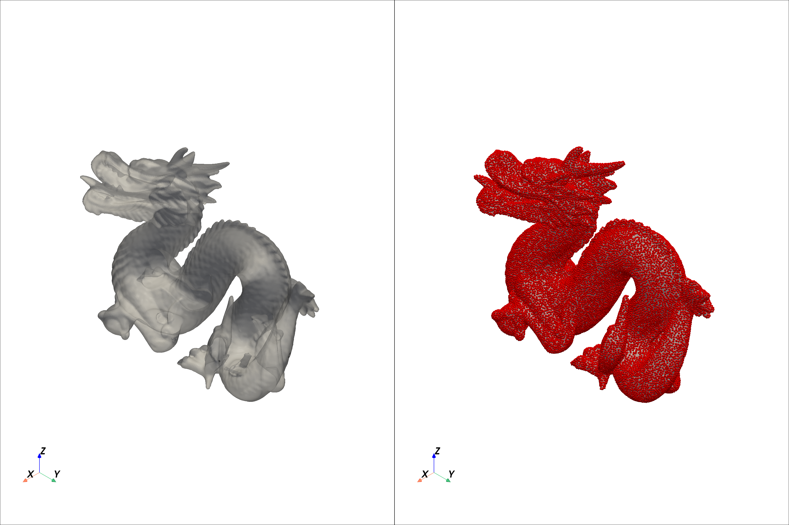

<div align="center">
  <pre style="font-family: 'Courier New', monospace; 
              line-height: 1.2; 
              white-space: pre-wrap;
              display: inline-block;
              padding: 10px;
              border-radius: 4px;
              border: 1px solid #3b0aceff;">
$$$$$$$\             $$$$$$\  $$$$$$$$\ $$$$$$$\  $$\   $$\ 
$$  __$$\           $$  __$$\ $$  _____|$$  __$$\ $$ |  $$ |
$$ |  $$ |$$\   $$\ $$ /  \__|$$ |      $$ |  $$ |$$ |  $$ |
$$$$$$$  |$$ |  $$ |$$ |      $$$$$\    $$$$$$$  |$$ |  $$ |
$$  ____/ $$ |  $$ |$$ |      $$  __|   $$  ____/ $$ |  $$ |
$$ |      $$ |  $$ |$$ |  $$\ $$ |      $$ |      $$ |  $$ |
$$ |      \$$$$$$$ |\$$$$$$  |$$ |      $$ |      \$$$$$$  |
\__|       \____$$ | \______/ \__|      \__|       \______/ 
          $$\   $$ |                                        
          \$$$$$$  |                                        
           \______/                                         
  </pre>
</div>

# PyCFPU

**PyCFPU** 是面向有向点云（点 + 法向）进行隐式曲面重建的高性能 Python 实现。算法基于 **Curl-Free RBF Partition of Unity (CFPU)** 方法。

本项目在原始 MATLAB 版本的基础上进行了完整的 Python 移植与工程化封装，并新增了基于 **CuPy** 的 **GPU 加速版本**，能够显著提升大规模点云重建的效率。

## 🌟 核心特性

*   **双引擎支持**：
    *   **CPU 版本**：基于 NumPy 和 SciPy，稳定可靠，兼容性好。
    *   **GPU 版本**：基于 CuPy，利用 GPU 强大的并行计算能力，适合处理大规模数据（需安装 CUDA 环境）。
*   **高精度**：GPU 版本经过深度优化，计算误差控制在 **1e-15** 数量级，与 CPU 版本结果完全一致。
*   **易用性**：提供统一的 API 接口，CPU/GPU 切换仅需更改导入路径。
*   **可视化**：内置 PyVista 可视化脚本，支持双视图联动查看重建结果与原始点云。

## 📚 来源与引用

*   **原始算法**：[1] K. P. Drake, E. J. Fuselier, and G. B. Wright. *Implicit Surface Reconstruction with a Curl-free Radial Basis Function Partition of Unity Method*. SIAM J. Sci. Comput. 42, A3018–A3040 (2022). doi:10.1137/20M1386166. ([arXiv](https://arxiv.org/abs/2101.05940))
*   **参考实现**：[GitHub - gradywright/cfpu](https://github.com/gradywright/cfpu) (MATLAB)

## 🛠️ 安装与环境

### 1. 基础依赖

项目依赖于 Python 3.8+。

```bash
pip install numpy scipy pyvista
```

### 2. GPU 支持（可选）

如需使用 GPU 加速功能，请根据您的 CUDA 版本安装对应的 `cupy` 包（例如 CUDA 12.x）：

```bash
pip install cupy-cuda12x
```

### 3. 安装本项目

建议以开发模式安装，以便随时修改代码并生效：

```bash
git clone https://github.com/your-repo/PyCFPU.git
cd PyCFPU
pip install -e .
```

## 🚀 快速开始

### 命令行工具

#### 1. 可视化重建 (CPU)

使用默认示例数据（TruncatedRing）进行重建并显示交互式窗口：

```bash
python scripts/render_pyvista.py --m 256
```

*   `--model`: 指定模型名称（如 `homer`, `stanford_dragon` 等，见 `data/` 目录）。
*   `--m`: 网格分辨率，数值越大细节越丰富（建议 256-500）。
*   `--jobs`: 并行线程数（0 表示自动检测）。

#### 2. GPU 性能测试

运行 GPU 版本的测试脚本，验证精度并对比 CPU/GPU 性能：

```bash
python scripts/test_gpu.py --m 256 --model TruncatedRing
```

#### 3. 批量生成结果图

批量渲染所有示例模型并保存图片到 `figures/` 目录：

```bash
python scripts/save_all_figs.py --m 256 --dpi 300
```

### Python API 调用

PyCFPU 提供了简洁的 Python API，您可以轻松集成到自己的项目中。

#### CPU 版本

```python
import numpy as np
from pycfpu.packages.cfpu import cfpurecon

# 1. 准备数据 (N, 3)
points = np.loadtxt('data/demo_nodes.txt')
normals = np.loadtxt('data/demo_normals.txt')
patches = np.loadtxt('data/demo_patches.txt') # 覆盖中心 (M, 3)

# 2. 配置参数
m = 256  # 网格分辨率
kernel = {'order': 1} # 默认使用一阶核函数
reg = {'exactinterp': 1, 'nrmlreg': 1, 'nrmllambda': 1e-4}

# 3. 执行重建
# 返回值: potential (3D grid), X, Y, Z (网格坐标)
potential, X, Y, Z = cfpurecon(points, normals, patches, m, kernel, reg)
```

#### GPU 版本

接口与 CPU 版本完全一致，只需修改导入路径：

```python
# 导入 GPU 版本
from pycfpu.packages.fastcfpu import cfpurecon

# ... 数据准备同上 ...

# 执行重建 (自动在 GPU 上进行)
potential, X, Y, Z = cfpurecon(points, normals, patches, m, kernel, reg)
```

## 📂 目录结构

```text
PyCFPU/
├── data/                   # 示例点云数据 (txt, vtp)
├── figures/                # 渲染结果截图
├── packages/               # 核心代码包
│   ├── cfpu.py             # CPU 实现 (NumPy/SciPy)
│   └── fastcfpu.py         # GPU 实现 (CuPy)
├── scripts/                # 实用脚本
│   ├── render_pyvista.py   # 可视化渲染入口
│   ├── test_gpu.py         # GPU 测试与基准对比
│   └── save_all_figs.py    # 批量绘图
├── tools/                  # 数据预处理工具
├── LICENSE
└── README.md
```

## ⚙️ 参数说明

`cfpurecon` 函数的主要参数：

| 参数 | 类型 | 说明 |
| :--- | :--- | :--- |
| `points` | `ndarray` | 输入点云坐标 (N, 3) |
| `normals` | `ndarray` | 输入点云法向 (N, 3)，应为单位向量 |
| `patches` | `ndarray` | 局部覆盖Patch的中心点坐标 (M, 3) |
| `gridsize` | `int/tuple` | 重建网格的分辨率 (如 256) |
| `kernelinfo` | `dict` | 核函数配置，默认 `{'order': 1}` (一阶多调和样条) |
| `reginfo` | `dict` | 正则化配置，包含 `exactinterp` (插值/拟合切换), `nrmllambda` (平滑度) 等 |
| `n_jobs` | `int` | (仅CPU) 并行线程数，None 或 0 为自动 |

## 📊 性能与兼容性

*   **精度**：GPU 版本采用了双精度 (`float64`) 计算，并通过自定义 CUDA Kernel 实现了与 CPU 版本 NumPy 逻辑的精确对齐，确保结果高度一致。
*   **内存**：GPU 版本显存占用与网格分辨率 (`m`) 的三次方成正比。对于超大分辨率（如 `m > 512`），请确保显存充足。
*   **兼容性**：代码已在 Windows 10/11 + CUDA 12.x 环境下测试通过。

## 🖼️ 结果展示

<table>
  <tr>
    <td><a href="figures/default_m256.png"></a></td>
    <td><a href="figures/stanford_bunny_m256.png"></a></td>
    <td><a href="figures/stanford_dragon_m256.png"></a></td>
  </tr>
</table>

更多结果请查看 `figures/` 目录。

## 🤝 贡献

欢迎提交 Issue 或 Pull Request 来改进代码或增加新功能。

## 📄 许可证

本项目遵循 MIT 许可证。详见 [LICENSE](LICENSE) 文件。
